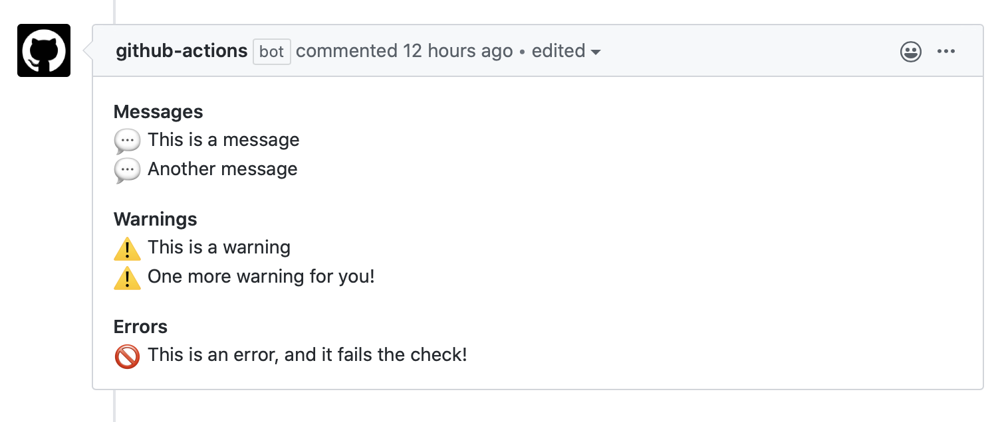

## Action Inputs

* **repo-token**: The GITHUB_TOKEN secret.
* **file-path**: The path to the Reginaldfile. **Default**: `.github/Reginaldfile.js`
* **reginald-id**: If you have multiple Reginalds, set this id so they don't override each other's comments. **Default**: `reginald`

## ReginaldDSL

In a Reginaldfile.js file you'll be able interact with a pull-request via the [ReginaldDSL](../src/dsl/ReginaldDSL.ts). Check you the sections below to understand how.

### Commenting

The ReginaldDSL provides three methods to add comments your pull-request. All the comments ar grouped under the same section, and the `error` comment fail the check:

Method|Group Symbol|Fail check
-|-|-
**reginald.message**|:speech_balloon:|No
**reginald.warning**|:warning:|No
**reginald.error**|:no_entry_sign:|Yes

**Example**

**Reginaldfile.js**

```js
reginald.message("This is a message")
reginald.message("Another message")
reginald.warning("This is a warning")
reginald.warning("One more warning for you!")
reginald.error("This is an error, and it fails the check!")
```

**Output**




### Acessing the pull-request data

You can access pull-request data via `reginald.pr`. [This property has the same properties as the `PullsGetResponse` type from the OctoKit library](https://developer.github.com/v3/pulls/#list-pull-requests).

### Accessing pull-request changed files

You can access the changed files in a pull-request via `reginald.git`. This property has three values:

* **addedFiles**: A list with the full-path of every **added** file on the pull-request. Only new files are in this list!
* **removedFiles**: A list with the full-path of every **removed** file on the pull-request. Only removed files are in this list!
* **modifiedFiles**: A list with the full-path of every **modified** file on the pull-request. Only modified files are in this list. Added and removed files are **NOT** part of this list.