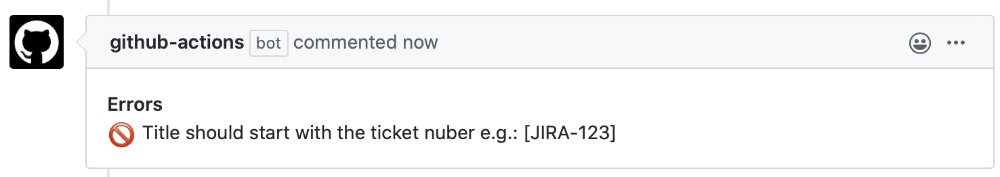

# Reginald

_Work in progress_

Reginald is a GitHub Action to triage your pull-request metadata. It is heavily inspired on [Danger](https://github.com/danger/danger).

Reginald provides methods to comment on the pull-request and fail the check:

```js
reginald.message('This is a message!')
reginald.warning('This is a warning!')
reginald.error('This is an error, and it will fail the pull-request!')
```

It provides information about the pull-request:

```js
reginald.pr: PullsGetResponse // https://developer.github.com/v3/pulls/#list-pull-requests
```

And it provides the list of changed files:

```js
reginald.git.addedFiles: string[] // List of added files
reginald.git.removedFiles: string[]  // List of removed files
reginald.git.modifiedFiles: string[] // List of modified files
```

### Getting Started

In this example we'll set up reginald to fail pull-requests with titles that doesn't start with the pattern `[JIRA-123]`.

By default, Reginald will look for a `Reginaldfile.js` file inside the `.github` folder, so let's create the file and add the following contents:

```js
if (!/\[[A-Z]+-[0-9]+\]\s/.test(reginald.pr.title)) {
  reginald.error("Title should start with the ticket id e.g.: [JIRA-123]")
}
```

You can access the pull-request data with `reginald.pr` and fail the checks with `reginald.error(message)`.

Now let's create the workflow file for reginald and add the following contents:

```yaml
name: "Reginald"
on:
  pull_request:
    types:
      - labeled
      - opened
      - edited
      - reopened
      - synchronize

jobs:
  triage-pr:
    runs-on: ubuntu-latest
    steps:
    - uses: alephao/reginald@develop
      with:
        repo-token: "${{ secrets.GITHUB_TOKEN }}"
```

That's it for a minimal setup, now if someone creates a pull-request that doesn't follow the `[JIRA-123] My title` pattern, the pull-request will fail and Reginald will add a comment with the reason why.



### Documentation

See the [Documentation](Documentation) folder:

### License

[MIT License](LICENSE)
